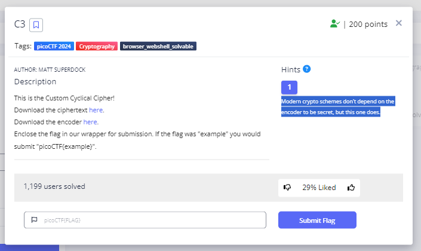
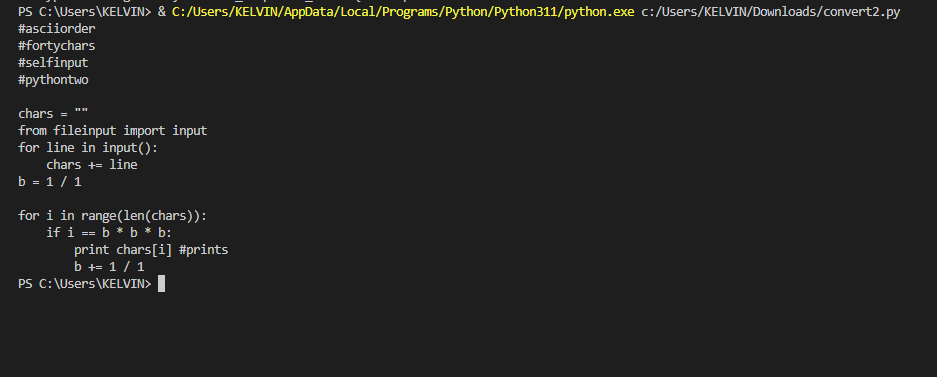
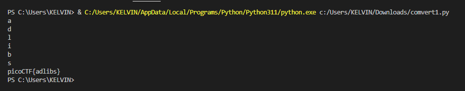

# **C3**
## **Description**
This is the Custom Cyclical Cipher!
Download the ciphertext [here](https://artifacts.picoctf.net/c_titan/47/ciphertext).
Download the encoder [here](https://artifacts.picoctf.net/c_titan/47/convert.py).
Enclose the flag in our wrapper for submission. If the flag was "example" you would submit "picoCTF{example}".
## **Hint**
- Modern crypto schemes don't depend on the encoder to be secret, but this one does.
  

## **Solution**
- download two files ciphertext and encoder then read and understand the encoder then modify it to decode the cipher text
- Here is the modified script to decode the hash
```
import sys

lookup1 = "\n \"#()*+/1:=[]abcdefghijklmnopqrstuvwxyz"
lookup2 = "ABCDEFGHIJKLMNOPQRSTabcdefghijklmnopqrst"

ciphertext = "DLSeGAGDgBNJDQJDCFSFnRBIDjgHoDFCFtHDgJpiHtGDmMAQFnRBJKkBAsTMrsPSDDnEFCFtIbEDtDCIbFCFtHTJDKerFldbFObFCFtLBFkBAAAPFnRBJGEkerFlcPgKkImHnIlATJDKbTbFOkdNnsgbnJRMFnRBNAFkBAAAbrcbTKAkOgFpOgFpOpkBAAAAAAAiClFGIPFnRBaKliCgClFGtIBAAAAAAAOgGEkImHnIl"

decoded_text = ""

prev = 0

# Decode the ciphertext
for char in ciphertext:
    cur = lookup2.index(char)
    original_index = (cur + prev) % 40  # Reverse the modular subtraction
    decoded_text += lookup1[original_index]
    prev = original_index

# Output the decoded plaintext
sys.stdout.write(decoded_text)
```
- After run it we got another script

  
- So lets combine this script with the encoder script in order to get flag
- Here is the combination of two scripts to get flag

```
import sys

# Decrypted message
ciphertext = "DLSeGAGDgBNJDQJDCFSFnRBIDjgHoDFCFtHDgJpiHtGDmMAQFnRBJKkBAsTMrsPSDDnEFCFtIbEDtDCIbFCFtHTJDKerFldbFObFCFtLBFkBAAAPFnRBJGEkerFlcPgKkImHnIlATJDKbTbFOkdNnsgbnJRMFnRBNAFkBAAAbrcbTKAkOgFpOgFpOpkBAAAAAAAiClFGIPFnRBaKliCgClFGtIBAAAAAAAOgGEkImHnIl"

lookup1 = "\n \"#()*+/1:=[]abcdefghijklmnopqrstuvwxyz"
lookup2 = "ABCDEFGHIJKLMNOPQRSTabcdefghijklmnopqrst"

plaintext = ""

for char in ciphertext:
    cur = lookup2.index(char)
    prev = lookup1.index(plaintext[-1]) if plaintext else 0
    plaintext += lookup1[(cur + prev) % 40]

chars = plaintext
b = 1

message = ''
for i in range(len(chars)):
    if i == b * b * b:
        print(chars[i])
        b += 1 / 1
        message += chars[i]

print("picoCTF{"+message+"}")
```

  
- And We got flag
```
picoCTF{custom_d2cr0pt6d_8b41f976}
```
