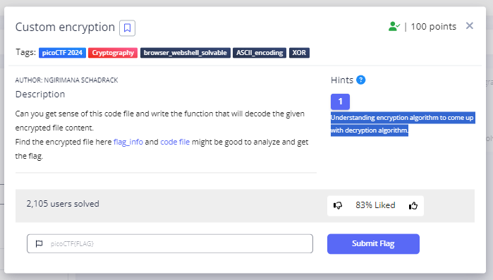
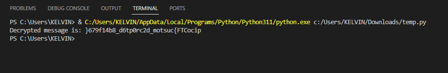
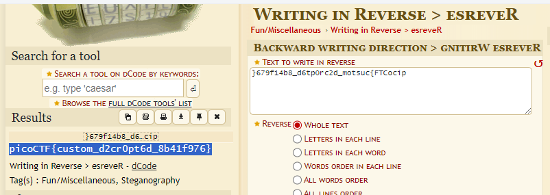

# **Custom Encryption**
## **Description**
Can you get sense of this code file and write the function that will decode the given encrypted file content.
Find the encrypted file here flag_info and code file might be good to analyze and get the flag.
## **Hint**
- Understanding encryption algorithm to come up with decryption algorithm.
  

## **Solution**
- In this challenge, the author provides the ciphertext and source code used for the plaintext encryption.
- I tried to read the source code used for encryption
- I tried to reverse the code used for decode and the results of the code are as below
```
def decrypt(cipher, key):
    decrypted_text = ""
    for num in cipher:
        decrypted_text += chr(num // (key*311))
    return decrypted_text

def dynamic_xor_decrypt(cipher_text, text_key):
    decrypted_text = ""
    key_length = len(text_key)
    for i, char in enumerate(cipher_text):
        key_char = text_key[i % key_length]
        decrypted_char = chr(ord(char) ^ ord(key_char))
        decrypted_text += decrypted_char
    return decrypted_text
    
def test_decrypt(cipher, shared_key, text_key):
    semi_cipher = decrypt(cipher, shared_key)
    plain_text = dynamic_xor_decrypt(semi_cipher, text_key)
    print(f"Decrypted message is: {plain_text}")

if __name__ == "__main__":
    cipher_text = [131553, 993956, 964722, 1359381, 43851, 1169360, 950105, 321574, 1081658, 613914, 0, 1213211, 306957, 73085, 993956, 0, 321574, 1257062, 14617, 906254, 350808, 394659, 87702, 87702, 248489, 87702, 380042, 745467, 467744, 716233, 380042, 102319, 175404, 248489]
    a = 94
    b = 21
    p = 97
    g = 31
    u = pow(g, a, p)
    v = pow(g, b, p)
    shared_key = pow(v, a, p)
    b_key = pow(u, b, p)
    if shared_key != b_key:
        print("Invalid shared key")
    else:
        text_key = "trudeau"
        test_decrypt(cipher_text, shared_key, text_key)

```  
  
- The code I used still produced a ciphertext
- But take it easy, the results are still easy to decrypt using the Backward Reverse direction tool

  
- And We got flag
```
picoCTF{s3cur3_c0nn3ct10n_8306c99d}
```
