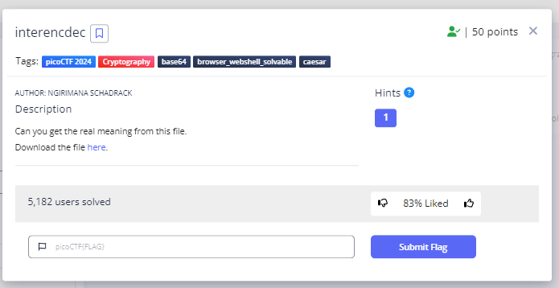
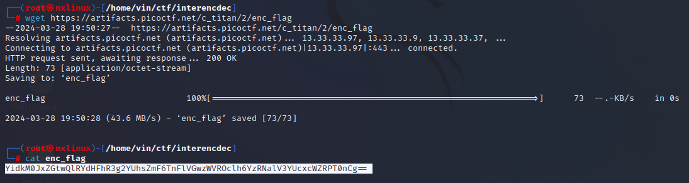
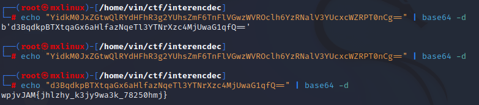
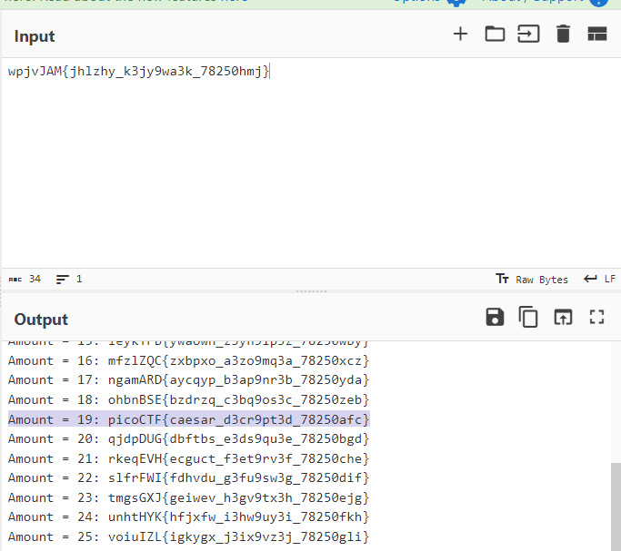

# **Interencdec**
## **Description**
Can you get the real meaning from this file.

Download the file [here.](https://artifacts.picoctf.net/c_titan/2/enc_flag)
## **Hint**
- Engaging in various decoding processes is of utmost importance
  

## **Solution**
- First, cat the file that has been downloaded via the link above


- we know that the file contains base64 ciphertext.
- to decrypt it use the following command
``` echo "YidkM0JxZGtwQlRYdHFhR3g2YUhsZmF6TnFlVGwzWVROclh6YzRNalV3YUcxcWZRPT0nCg==" | base64 -d ```
- after that, decrypt it again using base64
``` echo "d3BqdkpBTXtqaGx6aHlfazNqeTl3YTNrXzc4MjUwaG1qfQ==" | base64 -d ```
- the code generated then, in my opinion, is the result of encryption from ROT13


- Use [Cyberchef](https://gchq.github.io/CyberChef/) or [Cryptii](https://cryptii.com/) web to decrypt it


- And We got flag
```
picoCTF{s3cur3_c0nn3ct10n_8306c99d}
```

