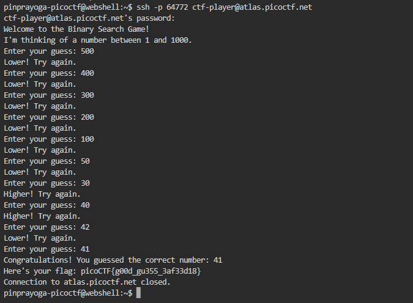
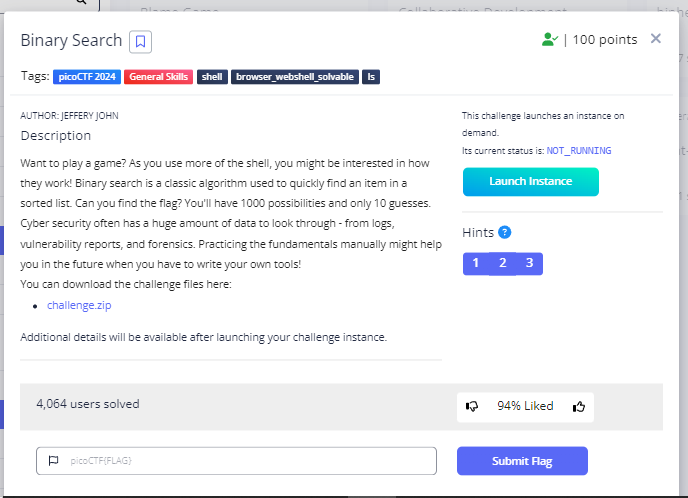

# **Binary Search**
## **Description**
Want to play a game? As you use more of the shell, you might be interested in how they work! Binary search is a classic algorithm used to quickly find an item in a sorted list. Can you find the flag? You'll have 1000 possibilities and only 10 guesses.
Cyber security often has a huge amount of data to look through - from logs, vulnerability reports, and forensics. Practicing the fundamentals manually might help you in the future when you have to write your own tools!

You can download the challenge files here:
## **Hint**
- Have you ever played hot or cold? Binary search is a bit like that.
- You have a very limited number of guesses. Try larger jumps between numbers!
- The program will randomly choose a new number each time you connect. You can always try again, but you should start your binary search over from the beginning - try around 500. Can you think of why?
  

## **Solution**
- In this challenge, I only guessed the numbers, starting from 500 and so on until I found the correct number.
  
- And We got the Flag
```
picoCTF{b1tw^3se_0p3eR@tI0n_su33essFuL_6ab1ad84}
```
