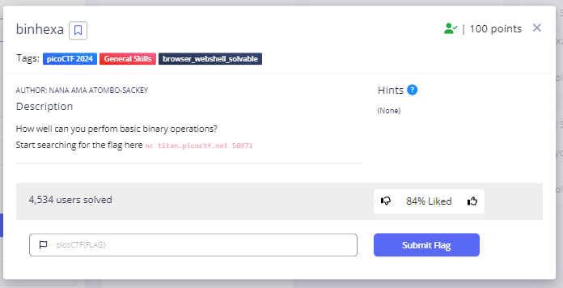
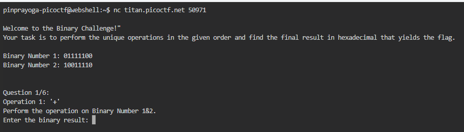
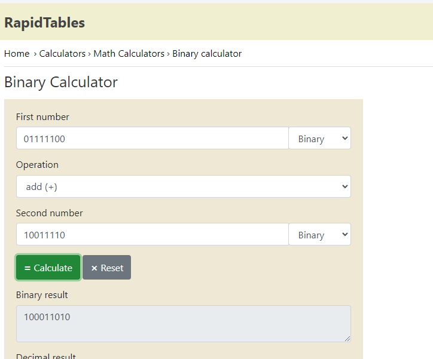
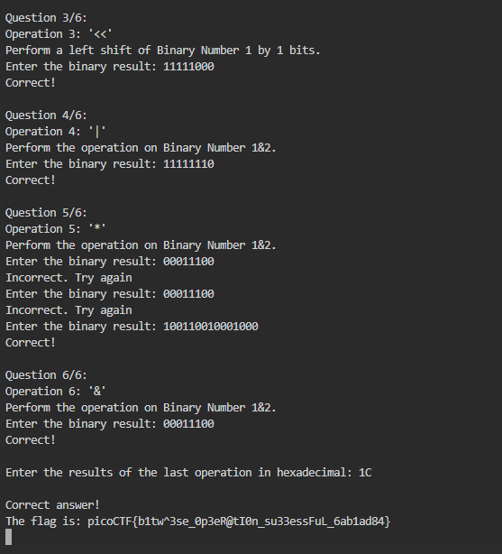

# **Binhexa**
## **Description**
How well can you perfom basic binary operations?

Start searching for the flag here nc titan.picoctf.net 50971
## **Hint**
- (None)
  

## **Solution**
- First, try accessing nc titan.picoctf.net 50971 using a pico web shell or your own virtual machine.

- This problem is a binary calculation problem ranging from addition, subtraction, division, multiplication, right shift, left shift, etc. 

- I use this website to complete the calculation, [click here](https://www.rapidtables.com/calc/math/binary-calculator.html) and [here](https://chat.openai.com/)

- And We got the Flag
```
picoCTF{@sk_th3_1nt3rn_e9957ce1}
```
