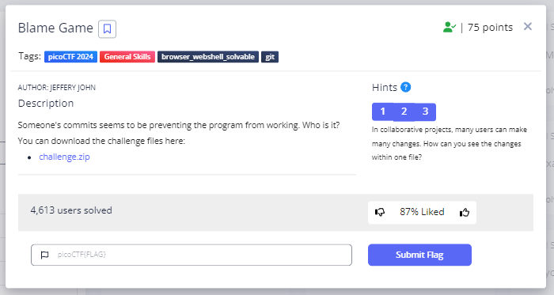
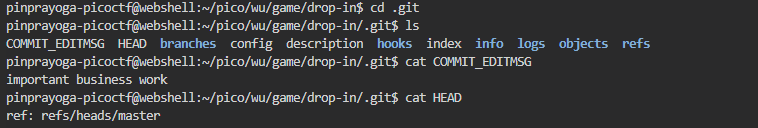
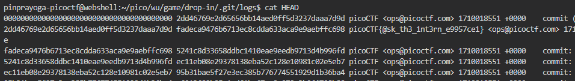

# **Blame Game**
## **Description**
Someone's commits seems to be preventing the program from working. Who is it?

You can download the challenge files here:

[challenge.zip](https://artifacts.picoctf.net/c_titan/73/challenge.zip)
## **Hint**
- In collaborative projects, many users can make many changes. How can you see the changes within one file?
- Read the chapter on Git from the picoPrimer here.
- You can use python3 <file>.py to try running the code, though you won't need to for this challenge.
  

## **Solution**
- When im extracting the challenge.zip it contain a message.txt then i use cat to display the content of the file

- I went into the logs directory and tried cat file HEAD

- I tried looking at all the logs from the HEAD file and the flag is on the second line

- And We got the Flag
```
picoCTF{@sk_th3_1nt3rn_e9957ce1}
```
