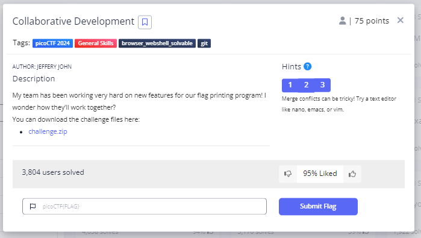
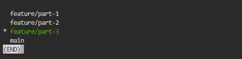
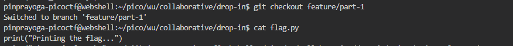
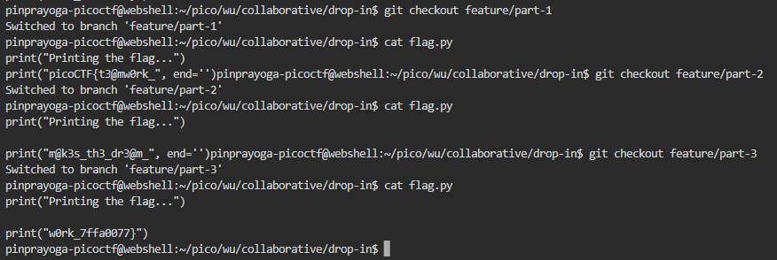

# **Collaborative Development**
## **Description**
My team has been working very hard on new features for our flag printing program! I wonder how they'll work together?

You can download the challenge files here:

[challenge.zip](https://artifacts.picoctf.net/c_titan/70/challenge.zip)
## **Hint**
- git branch -a will let you see available branches
- How can file 'diffs' be brought to the main branch? Don't forget to git config!
- Merge conflicts can be tricky! Try a text editor like nano, emacs, or vim.
  

## **Solution**
- I tried using the git branch -a syntax and the flag is probably divided into 3 parts

- I tried using the syntax git checkout features/part-1 and the output looks like this

- I thought that the flags should be arranged from part1 to part3 so that the file should be painted one by one to combine the flags.



- And We got the Flag
```
picoCTF{t3@mw0rk_m@k3s_th3_dr3@m_w0rk_7ffa0077}
```
