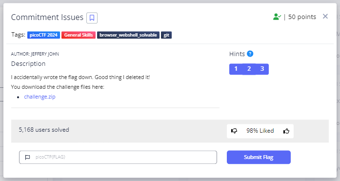
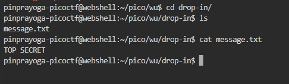
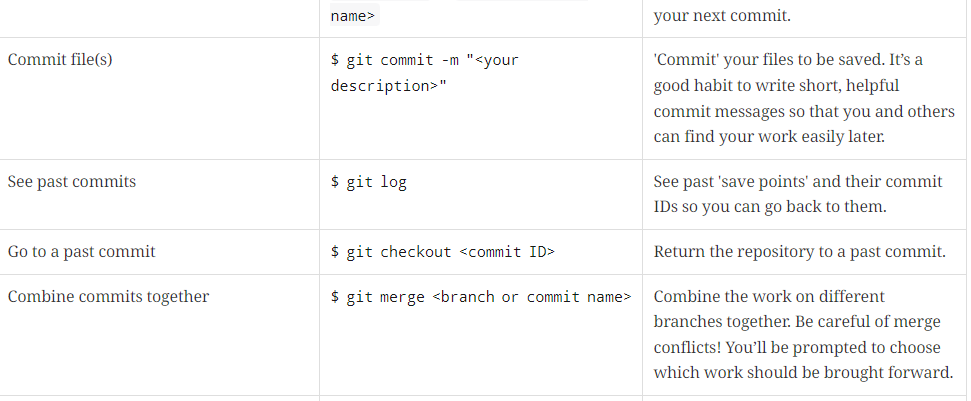
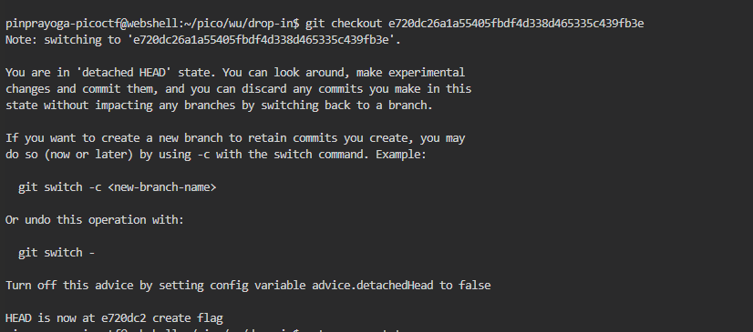

# **Commitment Issues**
## **Description**
I accidentally wrote the flag down. Good thing I deleted it!
You download the challenge files here:
[challenge.zip](https://artifacts.picoctf.net/c_titan/76/challenge.zip)
## **Hint**
- Version control can help you recover files if you change or lose them!
- Read the chapter on Git from the picoPrimer here
- You can 'checkout' commits to see the files inside them
  

## **Solution**
- When im extracting the challenge.zip it contain a message.txt then i use cat to display the content of the file

- This is not the flag and Then I see the hint number 2 & 3
- Seeing the hint, I immediately looked for a command about "checkout" then I found this\

- Then I run the commands $ git log to see all the “save point” and the commit id

- The second commit seems suspicious, so I go to that repository with $ git checkout <id> then display the content message.txt once again with cat.

- And We got the Flag
```
picoCTF{s@n1t1z3_7246792d}
```

