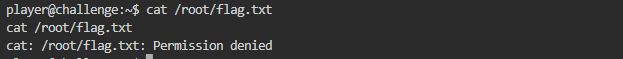

# **Dont You Love Banners**
## **Description**
Can you abuse the banner?
The server has been leaking some crucial information on tethys.picoctf.net 52039. Use the leaked information to get to the server.
To connect to the running application use nc tethys.picoctf.net 53223. From the above information abuse the machine and find the flag in the /root directory.
## **Hint**
- Do you know about symlinks?
- Maybe some small password cracking or guessing
  
  
## **Solution**
- Access links are given using nc, namely ```nc tethys.picoctf.net 52039```.
- The first link displays the password used to enter the second link.

  
- After that, continue to enter the second link ```nc tethys.picoctf.net 53223```.
- The second link tells the user to enter a password and after that is given a global question listed in the picture below.
- To answer it is very easy because there is already AI technology that can help us

  
- After logging in, try the ls command to see the contents of the root directory like this ```ls -la /root```

  
- We are not given access to read the flag.txt file in the root directory

  
- Instead we will use softlink / symslink to redirect the contents of flag.txt to the banner file with the command ```ln -s /root/flag.txt banner```
- Delete the previous banner file using the ``rm -rf banner`` command first

  
- Try to connect it again then the flag will be visible in the banner

  
- And We got the Flag
```
picoCTF{b4nn3r_gr4bb1n9_su((3sfu11y_b3ee718e}
```
