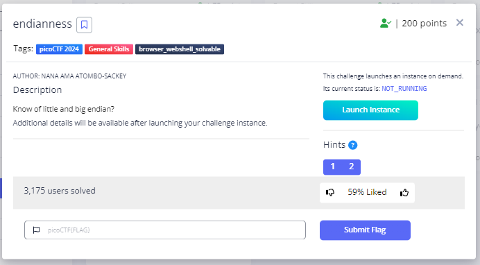
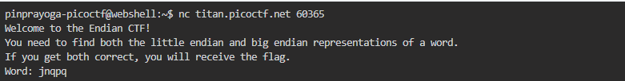
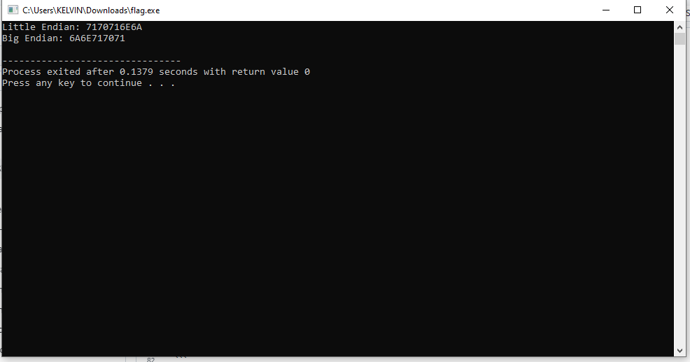

# **Endianness**
## **Description**
Know of little and big endian?
## **Hint**
- You might want to check the ASCII table to first find the hexadecimal representation of characters before finding the endianness.
- Read more about how endianness [here](https://levelup.gitconnected.com/little-endian-and-big-endian-74ab6441b2a7)
  

## **Solution**
- This challenge asks us to present Little Indian and Big Indian from a hexadecimal.
  
- I tried to read the source code provided and tried to remove some commands that were not needed.
- Then, added some commands so that it can produce hexadecimal output of little indian and big indian.
- Here is the script below
```
#include <stdio.h>
#include <stdlib.h>
#include <string.h>

// Function to convert string to little endian representation
char *find_little_endian(const char *word) {
    size_t word_len = strlen(word);
    char *little_endian = (char *)malloc((2 * word_len + 1) * sizeof(char));

    if (little_endian == NULL) {
        // Memory allocation failed
        return NULL;
    }

    for (size_t i = word_len; i-- > 0;) {
        snprintf(&little_endian[(word_len - 1 - i) * 2], 3, "%02X", (unsigned char)word[i]);
    }

    little_endian[2 * word_len] = '\0';
    return little_endian;
}

// Function to convert string to big endian representation
char *find_big_endian(const char *word) {
    size_t length = strlen(word);
    char *big_endian = (char *)malloc((2 * length + 1) * sizeof(char));

    if (big_endian == NULL) {
        // Memory allocation failed
        return NULL;
    }

    for (size_t i = 0; i < length; i++) {
        snprintf(&big_endian[i * 2], 3, "%02X", (unsigned char)word[i]);
    }

    big_endian[2 * length] = '\0';
    return big_endian;
}

int main() {
    const char *input = "jnqpq"; // Example input string

    // Test little endian conversion
    char *little_endian_str = find_little_endian(input);
    if (little_endian_str != NULL) {
        printf("Little Endian: %s\n", little_endian_str);
        free(little_endian_str); // Free allocated memory
    } else {
        printf("Memory allocation failed for little endian conversion.\n");
    }

    // Test big endian conversion
    char *big_endian_str = find_big_endian(input);
    if (big_endian_str != NULL) {
        printf("Big Endian: %s\n", big_endian_str);
        free(big_endian_str); // Free allocated memory
    } else {
        printf("Memory allocation failed for big endian conversion.\n");
    }

    return 0;
}
```
- Copy the requested word from the challenge. then run it using the c script file that has been created
  
- And We got the Flag
```
picoCTF{3ndi4n_sw4p_su33ess_817b7cfe}
```
