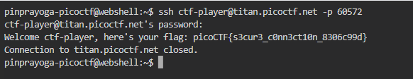

# **Super SSH**
## **Description**
Using a Secure Shell (SSH) is going to be pretty important. 
Can you ssh as ctf-player to titan.picoctf.net at port 60572 to get the flag?
You'll also need the password 1ad5be0d. If asked, accept the fingerprint with yes.
If your device doesn't have a shell, you can use: https://webshell.picoctf.org
If you're not sure what a shell is, check out our Primer: https://primer.picoctf.com/#_the_shell
## **Hint**
- https://linux.die.net/man/1/ssh
- You can try logging in 'as' someone with <user>@titan.picoctf.net
- How could you specify the port?
- Remember, passwords are hidden when typed into the shell

## **Solution**
- On this challage we only need to do ssh on account that has been provided.

- And We got flag
```
picoCTF{s3cur3_c0nn3ct10n_8306c99d}
```

