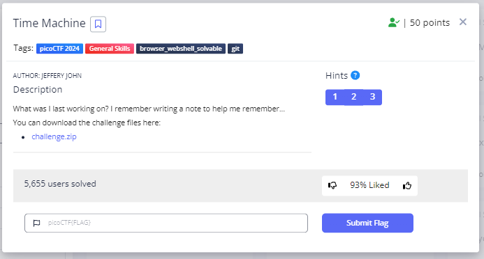
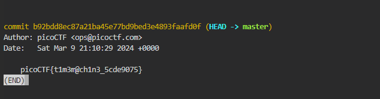
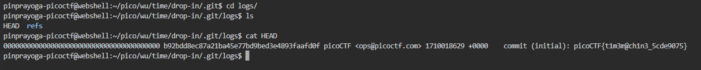

# **Time Machine**
## **Description**
What was I last working on? I remember writing a note to help me remember...
You can download the challenge files here:
[challenge.zip](https://artifacts.picoctf.net/c_titan/67/challenge.zip)
## **Hint**
- The cat command will let you read a file, but that won't help you here!
- Read the chapter on Git from the picoPrimer here.
- When committing a file with git, a message can (and should) be included.
  

## **Solution**
- This challenge is the same type as Commitment Issues above the git challenge. First I downloaded the file and unzip it then dispay the content with cat
  
- We are instructed to look for commit history. We can use $ git log for that
  
So the flag is in the description when we commit the latest update in the repository
  
- And We got the Flag
```
picoCTF{t1m3m@ch1n3_5cde9075}
```
